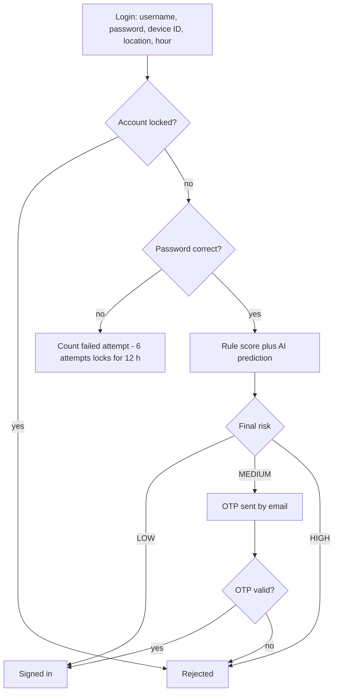

# AdaptiveMFA-ACS

A **risk-based (adaptive) multi-factor authentication** system built as a project-based learning exercise with **Spring Boot** and **React**.

Instead of asking every user for a one-time password (OTP) on every login, the system scores each sign-in attempt. It checks whether the **device**, **location** and **time of day** are familiar, how many **failed attempts** there have been, and (optionally) what a **machine-learning model** thinks. It then decides:

| Final risk | What happens |
|------------|--------------|
| **LOW** | Signed in immediately |
| **MEDIUM** | A one-time code is sent by email, and the user must enter it |
| **HIGH** | Access denied |

Users can then **remember** their current device, location and login time, so future sign-ins from familiar contexts need no extra step.

---

## Features

- **Registration with security enrollment.** The first device, location and login hour are trusted automatically.
- **Risk-based login.** A rule engine (device, location, time, failed attempts) is combined with an optional AI prediction.
- **OTP by email.** Login codes and password-reset codes are emailed, with a console mode for development.
- **Trusted factors.** Remember or remove trusted devices, locations (with a radius) and login-time windows, including windows that cross midnight.
- **Sign-in history.** Every user can see their own audit trail. Administrators can see everyone's.
- **Account protection.** Lockout after 6 failed attempts (auto-unlock after 12 hours), rate limiting, password policy, and session handling with logout.
- **Graceful degradation.** If the AI service is down, login keeps working using the rule engine only.
- **Browser-friendly location handling.** If location permission is denied, login still works and the location is simply treated as untrusted.

---

## Tech stack

| Layer | Technology |
|-------|-----------|
| Backend | Java 17+, Spring Boot 4 (Web, Security, Data JPA, Validation, Mail) |
| Database | PostgreSQL |
| Frontend | React 19, Vite |
| Optional AI service | A separate Python service (not included) exposing `POST /predict` on port 8000 |

---

## How a login is decided



### Rule score

| Condition | Points |
|-----------|-------:|
| Failed attempts 0-2 | 0 |
| Failed attempts 3-5 | +40 |
| Failed attempts 6 or more | +80 |
| Device not trusted | +30 |
| Location not trusted | +20 |
| Unusual login time | +20 |

Score **below 30 = LOW**, **30-59 = MEDIUM**, **60 or more = HIGH**.

The **final risk is the more severe of the rule result and the AI result**. If the AI service is unavailable, the rule result alone is used.

### What counts as a "trusted location"

A position is trusted when the browser reports an accuracy no worse than **1000 m** (configurable) and the position lies inside the radius of one of the user's trusted locations. When a location is remembered, its radius is at least as large as the accuracy of the fix it came from. Very imprecise fixes (for example IP-based ones) are refused with an explanation.

---

## Project structure

```
.
├── src/main/java/com/adaptivemfa/acs/     Spring Boot backend
│   ├── config/         Spring Security, CORS, JSON 401/403 responses
│   ├── controller/     REST endpoints
│   ├── dto/            Request and response objects
│   ├── exception/      Custom exceptions and the global handler
│   ├── model/          JPA entities and request models
│   ├── repository/     Spring Data repositories
│   ├── security/       UserDetails loading
│   └── service/        Business logic (risk, MFA, OTP, trust, audit, ...)
├── src/main/resources/application.properties
└── frontend/                              React (Vite) frontend
    └── src/
        ├── pages/         LoginPage, RegistrationPage
        ├── components/    Dashboard, trusted-factor lists, audit logs, MFA screen
        └── services/      API calls, device ID, geolocation
```

Key backend services:

| Service | Responsibility |
|---------|----------------|
| `AuthenticationService` | The whole login and MFA flow |
| `RiskAssessmentService` | Rule score, AI prediction, final risk |
| `LocationRiskService` | Single place that decides if a position is trusted |
| `MFAService` | OTP generation, expiry (2 minutes) and attempts (max 3) |
| `OtpSender` | Delivery interface, with `EmailOtpSender` and `ConsoleOtpSender` |
| `RecentAuthenticationService` | Allows changing trusted factors only shortly (10 min) after sign-in |
| `RateLimitService` | 5 requests per minute per action and username |

---

## Getting started

### Prerequisites

- Java 17 or newer and Maven
- PostgreSQL
- A current Node.js LTS (20.19+ or 22.12+) and npm
- (Optional) the Python AI service

### 1. Database

```sql
CREATE DATABASE adaptive_mfa;
```

Tables are created automatically (`spring.jpa.hibernate.ddl-auto=update`). Set your database password without editing the file by using an environment variable:

```
SPRING_DATASOURCE_PASSWORD=your-password
```

### 2. Mail dependency

Make sure `pom.xml` contains:

```xml
<dependency>
    <groupId>org.springframework.boot</groupId>
    <artifactId>spring-boot-starter-mail</artifactId>
</dependency>
```

### 3. Choose how OTPs are delivered

| Mode | How |
|------|-----|
| **Gmail** | Turn on 2-step verification, create a Google *App Password*, then set `MAIL_USERNAME` and `MAIL_PASSWORD` |
| **MailHog (best for testing)** | `docker run -p 1025:1025 -p 8025:8025 mailhog/mailhog`, then set `MAIL_HOST=localhost MAIL_PORT=1025 MAIL_SMTP_AUTH=false MAIL_STARTTLS=false` and read mail at http://localhost:8025 |
| **Console (development only)** | `SPRING_PROFILES_ACTIVE=dev` prints the OTP in the backend console |

### 4. Run the backend

```bash
mvn spring-boot:run
```

It starts on **http://localhost:8081**.

### 5. Run the frontend

```bash
cd frontend
npm install
npm run dev
```

Open **http://localhost:5173**. If Vite picks port 5174 because 5173 is busy, that origin is allowed too.

### 6. Try it

1. Click **Create an account** and register with a real or MailHog email address. Allow location access when the browser asks.
2. Sign in. Your device, location and hour were enrolled, so you go straight in (LOW risk).
3. Sign in from another browser or profile (an untrusted device) to trigger the **OTP** step.
4. On the dashboard, use **Remember device / location / login time**, and open **My Sign-in History**.

---

## Configuration

| Setting | Default | Purpose |
|---------|---------|---------|
| `server.port` | `8081` | Backend port |
| `mfa.location.max-accuracy-meters` | `1000` | Worst GPS accuracy still considered usable |
| `mfa.cors.allowed-origins` | `http://localhost:5173,http://localhost:5174` | Frontend origins allowed to call the API |
| `MAIL_HOST` / `MAIL_PORT` | `smtp.gmail.com` / `587` | SMTP server |
| `MAIL_USERNAME` / `MAIL_PASSWORD` | empty | SMTP credentials (environment variables only) |
| `MAIL_SMTP_AUTH` / `MAIL_STARTTLS` | `true` / `true` | SMTP options |
| `VITE_API_BASE_URL` (frontend `.env`) | `http://localhost:8081` | Where the frontend finds the API |

---

## API overview

Everything except the **public** endpoints requires a signed-in session cookie.

### Public

| Method | Endpoint | Purpose |
|--------|----------|---------|
| POST | `/users/register` | Create an account (username, password, email) |
| POST | `/security/enroll` | One-time enrollment of the first device, location and time |
| POST | `/auth/login` | Start a login, returns `AUTHENTICATED`, `MFA_REQUIRED` or `ACCESS DENIED` |
| POST | `/auth/verify-mfa` | Submit the emailed OTP |
| POST | `/auth/logout` | End the session |
| POST | `/auth/forgot-password` | Email a reset code (same answer whether or not the account exists) |
| POST | `/auth/reset-password` | Set a new password with the reset code |

### Signed-in users

| Method | Endpoint | Purpose |
|--------|----------|---------|
| POST | `/auth/change-password` | Change the password |
| GET / POST / DELETE | `/security/devices`, `/security/devices/remember`, `/security/devices/{deviceId}` | Trusted devices |
| GET / POST / DELETE | `/security/locations`, `/security/locations/{id}` | Trusted locations |
| GET / POST / DELETE | `/security/login-times`, `/security/login-times/remember`, `/security/login-times/{id}` | Trusted login-time windows |
| GET | `/security/my-audit-logs?limit=50` | The user's own sign-in history |

### Administrators only (`ROLE_ADMIN`)

| Endpoint | Purpose |
|----------|---------|
| `/audit/**` | All users' audit logs, statistics, suspicious activity |
| `/admin/**` | Unlock accounts, audit views |

There is no screen for creating an admin. To make one, update the role in the database:

```sql
UPDATE app_users SET role = 'ADMIN' WHERE username = 'your-username';
```

---

## Optional: the AI risk service

The backend calls `POST http://127.0.0.1:8000/predict` with:

```json
{
  "failed_attempts": 0,
  "trusted_device": 1,
  "trusted_location": 1,
  "unusual_time": 0,
  "password_failed": 0
}
```

and expects something like:

```json
{ "predicted_risk": "LOW", "probabilities": { "LOW": 0.92, "MEDIUM": 0.07, "HIGH": 0.01 } }
```

If the service is not running or is slow (3 s connect / 5 s read timeouts), the backend uses the rule engine only and the dashboard shows the AI result as `UNAVAILABLE`.

---

## Security notes

- Passwords are hashed (BCrypt). The policy requires 8+ characters with upper-case, lower-case, a digit and a special character.
- OTPs expire after 2 minutes, work once, allow 3 attempts, and are never shown to the user by the API.
- Trusted factors can only be changed within 10 minutes of a successful sign-in.
- `/security/enroll` works **once** per account, so a stolen password cannot be used to register an attacker's device as trusted.
- Sessions are regenerated at login to prevent session fixation.
- The API returns JSON errors with proper status codes (400, 401, 403, 404, 409, 422, 423, 429, 503).

---

## Known limitations and ideas for next steps

- **OTPs are stored in server memory.** A restart invalidates them and you cannot run multiple servers. Use Redis or the database for production, and store only a hash.
- **No "resend OTP" button.** Users must sign in again if a code expires.
- **CSRF protection is disabled.** Acceptable for a local learning project, but enable it before deploying.
- **No automated tests yet.** Good next steps: JUnit and MockMvc for the backend, Vitest and React Testing Library for the frontend.
- **Admin screens are not built.** The admin APIs exist, but the frontend has no admin pages.
- **Ideas:** SMS or authenticator-app (TOTP) delivery through the `OtpSender` interface, trusted-device expiry, email notifications for new-device sign-ins, Docker Compose for the whole stack.

---

## Troubleshooting

| Problem | Likely cause |
|---------|--------------|
| Frontend shows "Unable to reach the server" | Backend not running on port 8081, or CORS origin mismatch |
| Login fails with a CORS error | The frontend runs on an origin not listed in `mfa.cors.allowed-origins` |
| "Remember location" says the location is too imprecise | The browser gave an IP-based fix; enable precise location or Wi-Fi |
| No OTP email arrives | Check spam, the App Password, port 587, or use MailHog |
| `AuthenticationFailedException` in the log | Wrong or expired Gmail App Password |
| App fails to start | Missing `spring-boot-starter-mail` dependency, or PostgreSQL is not running |
| A user is told "No email address is registered" | An account created before email was added; set it with SQL (`UPDATE app_users SET email = ... `) |